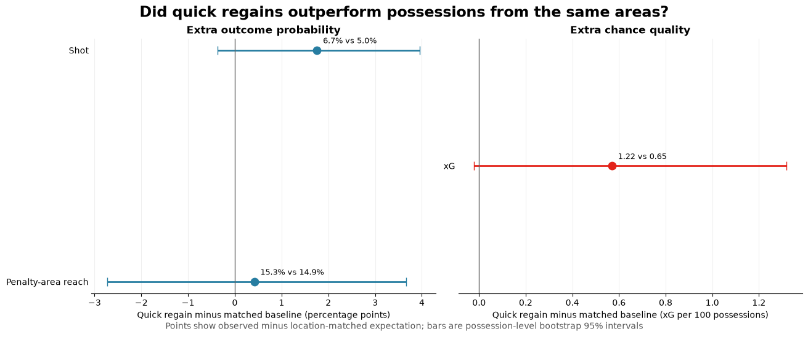
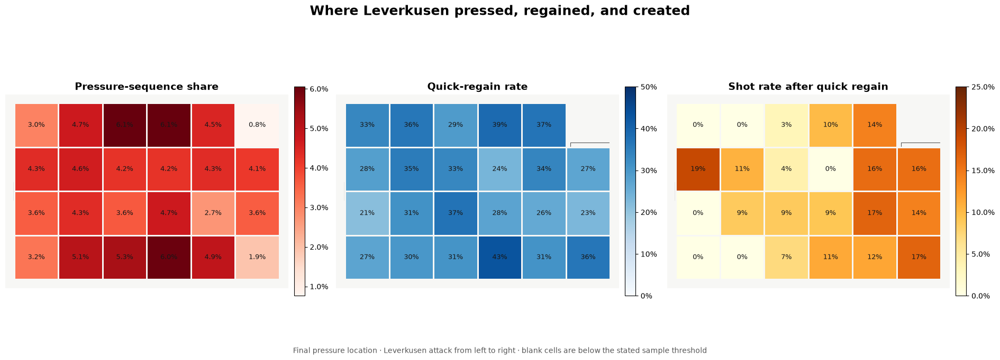

# Bayer Leverkusen 2023/24: Pressing Analysis

A possession-level analysis of how Bayer Leverkusen pressed, regained the ball and created chances during their unbeaten 2023/24 Bundesliga season.

**[Read the visual report](reports/bayer-leverkusen-pressing-analysis.pdf)** · **[Explore the full notebook](notebooks/bayer-leverkusen-pressing-analysis.ipynb)**



## Question

How often did Leverkusen regain possession shortly after applying pressure, and did those quick regains produce more attacking value than ordinary open-play possessions beginning in similar areas?

## Key results

The analysis covers all 34 league matches and 137,765 StatsBomb events. It consolidates 3,964 pressure events made during opposition possessions into 1,702 fully observed possession-level sequences.

| Result | Value |
|---|---:|
| Regains within five seconds | 538 of 1,702 (31.6%) |
| Quick regains followed by a shot within 15 seconds | 46 of 538 (8.6%) |
| Goals from those shots | 4 |
| Quick regains retained for the location-matched comparison | 489 |

After controlling coarsely for where possessions began, quick regains produced higher point estimates for shots and expected goals, but every 95% bootstrap interval included zero.

| Outcome within 15 seconds | Quick regains | Matched expectation | Difference | 95% bootstrap interval |
|---|---:|---:|---:|---:|
| Penalty-area reach | 15.3% | 14.9% | +0.4 pp | −2.7 to +3.7 pp |
| Shot | 6.7% | 5.0% | +1.8 pp | −0.4 to +4.0 pp |
| xG per 100 possessions | 1.22 | 0.65 | +0.57 | −0.02 to +1.32 |

These estimates are suggestive rather than conclusive. The project is descriptive and does not claim that pressing caused the differences.

## Approach

- Grouped individual pressure events into distinct opposition possessions, using the final pressure as the sequence reference point.
- Marked sequences too close to the end of a period as censored instead of treating them as failed regains.
- Defined a quick regain as Leverkusen taking possession within five seconds.
- Measured penalty-area entries, shots and xG during the first 15 seconds of the resulting possession.
- Compared quick regains with ordinary open-play possessions starting in the same three-by-three pitch grid; cells with fewer than 30 baseline possessions were excluded.
- Used 5,000 possession-level bootstrap samples to quantify uncertainty.



## Tools

Python · pandas · NumPy · Matplotlib · mplsoccer · Jupyter

## Data

The project uses [StatsBomb Open Data](https://github.com/statsbomb/open-data), loaded through `mplsoccer.Sbopen`. The notebook selects Bundesliga competition ID `9` and season ID `281`, then downloads the event data for Leverkusen's 34 matches.

StatsBomb attribution is retained in both the notebook and report. An internet connection is required to rerun the data-loading cells.

## Repository structure

```text
.
├── assets/       # Charts used in this README
├── notebooks/    # Complete analysis with saved outputs
├── reports/      # Five-page visual report
├── README.md
└── requirements.txt
```

## Reproduce the analysis

The notebook was created with Python 3.12. From the repository directory:

```bash
python -m venv .venv
```

Activate the environment, then run:

```bash
python -m pip install -r requirements.txt
jupyter lab notebooks/bayer-leverkusen-pressing-analysis.ipynb
```

Run the notebook from top to bottom. A fixed random seed makes the bootstrap results repeatable, although upstream open data or package changes may affect future runs.

## Limitations

- The five- and 15-second windows are analytical choices, not universal definitions.
- The spatial matching uses broad pitch areas and does not control for game state, opponent, player availability or tactical context.
- Some subgroup estimates have small samples.
- The analysis uses event data rather than player-tracking data, so it cannot measure team shape or pressure intensity directly.

## Author

Daniel Claytor — Mathematics graduate interested in data analysis, modelling and football.
